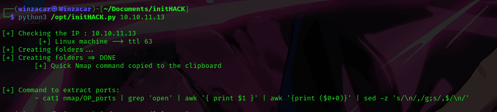
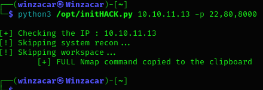

# initHACK: Automate Pentesting Folder Setup and Nmap Scans.

This Python script streamlines the initial setup for penetration testing by automating folder creation and Nmap scan configuration. It saves you time by handling repetitive tasks, allowing you to focus on the actual testing process.


## Getting Started

Make sure you have `xclip` installed on your system. You can usually install it using your package manager (e.g., `apt install xclip` on Debian-based systems).


## Usage

### Command: Scan for all open ports 
1. Run the script with the target IP address:

```bash
python3 /opt/initHACK.py 10.10.11.13
```




2. The script will:

* Check the target's OS (Linux/Windows)
* Create the testing environment folders (Content, Exploits, Nmap, Post-exploit for large networks)
* Copy a basic Nmap scan command to your clipboard targeting open ports.

3. Paste the copied command and run it to scan for open ports.
```bash
sudo nmap -p- --open -sS -vvv -n -Pn  10.10.11.13 -oN nmap/OP_ports
```

* **-p-** --> scan entire range of ports 
* **--open** --> Only show open (or possibly open) ports
* **-sS** -->  TCP SYN scan
* **-vvv** --> verbosity level 
* **-n** --> Never do DNS resolution
* **-Pn** --> skip host discovery
* **-oN** --> normal output

4. to extract the ports form the scan I just copy and pasted the command provided at the end of initHAck

```bash
cat nmap/OP_ports | grep 'open' | awk '{ print $1 }' | awk '{print ($0+0)}' | sed -z 's/\n/,/g;s/,$/\n/'
```


### Command: Scan by specifying ports 

If you already know which ports are open, you can speed up the process by specifying them:

1. Extract the ports --> command provided in *step 4* of  [Scan for all open ports](#command-scan-for-all-open-ports)

```bash
python3 /opt/initHACK.py 10.10.11.13 -p 22,80,8000
```


2. Run the script with the target IP and desired ports (comma-separated):

```bash
sudo nmap -sS -sV -sC -p22,80,8000 -Pn -n -vvv 10.10.11.13 -oA nmap/allPorts
```


***Credits:** Inspired by s4vitar's work. I just wanted to make a more presonalized version that fits more to how im used to work. Please, Feel free to reach out if you have any questions or suggestions for improvement!

