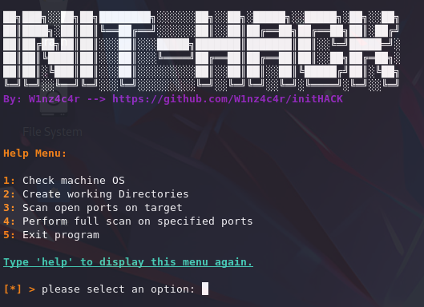
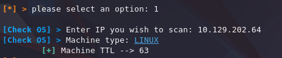
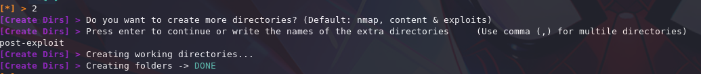
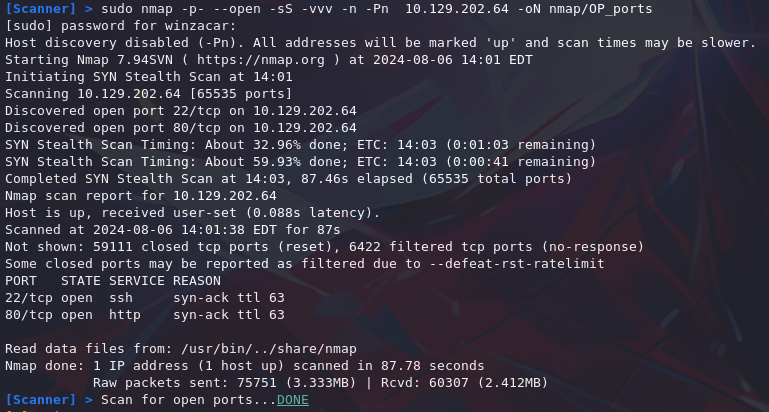
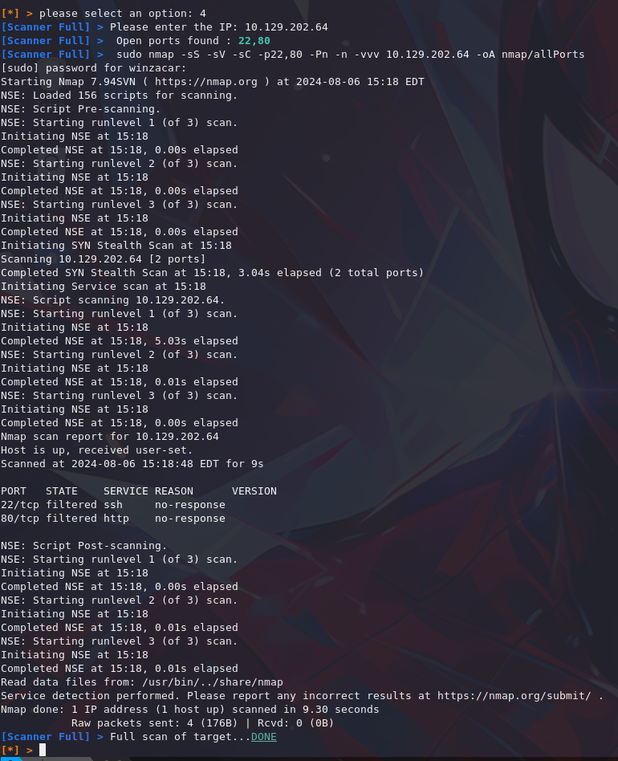

# initHACK: Automate Pentesting Folder Setup and Nmap Scans.

This Python script streamlines the initial setup for penetration testing by automating folder creation and Nmap scan configuration. It saves you time by handling repetitive tasks, allowing you to focus on the actual testing process.

## Features

* Check the target's OS (Linux/Windows).
* Create testing environment folders (Content, Exploits & Nmap), with the ability to create more folders if specified.
* Perform an Nmap scan to find open ports.
* Perform a full Nmap scan on the specified ports.

## Pre-requisites

Ensure you have the following Python libraries installed:

sys
subprocess
re
art
signal
ipaddress
termcolor
You can install the required libraries using pip:
```bash
pip install art termcolor
```

## Getting Started

Clone the repository:
```bash
git clone https://github.com/W1nz4c4r/initHACK.git
cd initHACK
```
## Usage

Run the script 

```bash
python3 /opt/initHACK.py 
```





### Option 1: Scan the target for OS



This will ping the target machine. Based on the *TTL response*, the script will determine the target's *OS*.

### Options 2: Create Directories

This will create the working directories commonly used in a pentest, with the possibility of creating extra directories if needed. The directories created will be:

* nmap
* content
* exploits




### Option 3: Scan for open ports
This option will perform an Nmap scan looking for the open ports on the specified target.

```bash
sudo nmap -p- --open -sS -vvv -n -Pn  10.10.11.13 -oN nmap/OP_ports
```

* **-p-** --> scan entire range of ports 
* **--open** --> Only show open (or possibly open) ports
* **-sS** -->  TCP SYN scan
* **-vvv** --> verbosity level 
* **-n** --> Never do DNS resolution
* **-Pn** --> skip host discovery
* **-oN** --> normal output



### Option 4: Perform a full scan on the target
This option will perform a full scan over the open ports previously found.

```bash
sudo nmap -sS -sV -sC -p22,80,8000 -Pn -n -vvv 10.10.11.13 -oA nmap/allPorts
```
* **-sS**: TCP SYN scan
* **-sV**: Version detection
* **-sC**: Run default scripts
* **-p**: Ports to scan
* **-Pn**: Skip host discovery
* **-n**: Never do DNS resolution
* **-vvv**: Verbosity level
* **-oA**: Output in three major formats



***Credits:** Inspired by s4vitar's work. I just wanted to make a more presonalized version that fits more to how im used to work. Please, Feel free to reach out if you have any questions or suggestions for improvement!

